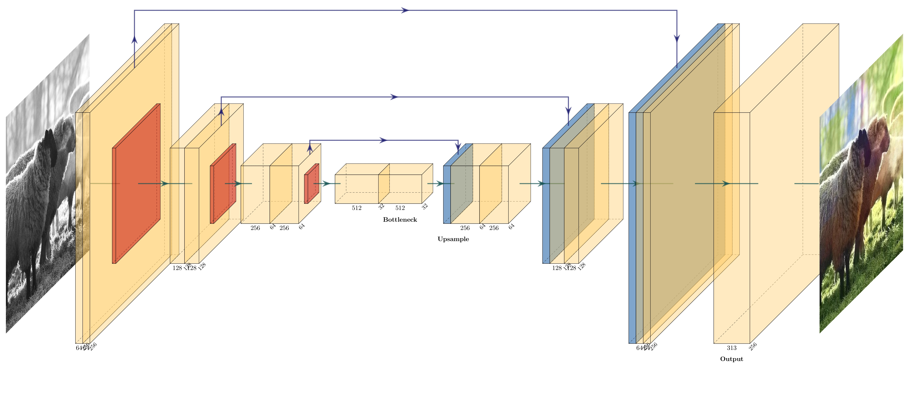

# 🎨 Prism - Image Colorization

Transform grayscale images into vibrant color photos using deep learning! Prism is a PyTorch-based U-Net model designed to predict and apply colors to black-and-white images.

## 📖 Overview

This project implements an Image Colorization model leveraging a U-Net architecture. The model is trained on the LAB color space, where it takes the grayscale `L` channel as input and predicts the color distribution across 313 discrete `ab` color buckets. 

A user-friendly web interface is provided using **Gradio**, allowing anyone to upload grayscale images and instantly see the colorized output.

## ✨ Features

- **U-Net Architecture:** Efficient encoder-decoder structure for high-quality image-to-image translation.
- **LAB Color Space Prediction:** Predicts quantized color coordinates over 313 discrete buckets for robust colorization.
- **Class Rebalancing:** Utilizes smoothed prior probabilities to encourage vibrant, less common colors.
- **Multi-GPU Training:** Features a DistributedDataParallel (DDP) training loop for scalable training across multiple GPUs.
- **Interactive GUI:** An easy-to-use Gradio web app for real-time inference.

## 🧠 Model Architecture



*For a detailed node-level view of the operations during the forward pass, check out the [Computational Graph details](docs/computational_graph.md).*

The model follows a U-Net structure with:
- **Encoder:** 4 Downsampling blocks composed of Conv2D, BatchNorm, and SiLU activations, followed by Max Pooling.
- **Decoder:** 3 Upsampling blocks using bilinear interpolation and skip connections from the encoder to retain spatial details.
- **Output:** A final Conv2D layer mapping to 313 output channels (corresponding to the quantized `ab` color buckets).

## 🚀 Getting Started

### Prerequisites

Ensure you have Python installed. Install the required dependencies using:

```bash
pip install -r requirements.txt
```

### Running the Web Interface

To launch the interactive Gradio web app locally:

```bash
python gui.py
```

This will start a local server (typically at `http://localhost:7860`). Open this URL in your browser to test the colorization with your own images or the provided examples in the `examples/` directory.

### Training the Model

The training script is designed for multi-GPU setups using PyTorch `torchrun`. You can launch the training session by exporting the notebook to a Python script and running it:

```bash
torchrun --nproc_per_node=2 <exported_script_name>.py
```

*Note: Make sure you have your dataset organized in the specified directories (`TrainDataset`, `ValDataset`, `TestDataset`) with `L` (grayscale images) and `AB` (target quantized color arrays) subdirectories before training.*

## 📂 Repository Structure

- `Model.ipynb` / `Model.py`: Model definition, PyTorch dataset loaders, DDP training loop, and evaluation scripts.
- `gui.py`: Gradio application for user-friendly model inference.
- `PrismModel.pth`: Saved model checkpoint/weights.
- `CoordBuckets.npy`: The 313 quantized coordinate buckets in the `ab` color space.
- `PriorProbs.npy`: Prior probabilities used for loss weighting during training.
- `examples/`: Sample images to test out the application.
- `hf-space/`: Files configured for Hugging Face Space deployment.

## 👥 Authors

- **Nishant Kalaichelvan** - [@nkminion](https://github.com/nkminion)
- **Varun Agnihotri** - [@PythonicVarun](https://github.com/PythonicVarun) - [hello@pythonicvarun.me](mailto:hello@pythonicvarun.me)

## 📜 License

See the [LICENSE](LICENSE) file for more details.
