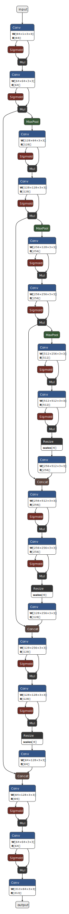

# Prism Computational Graph

## Overview

This document provides a detailed visualization of the low-level computational graph for the Prism Image Colorization model. This graph maps out the precise tensor operations executed during the model's forward pass.

## Key Operations Explained

- **Conv (Convolution):** Standard 2D Convolutional layers. The graph denotes the weights tensor shape (e.g., `W <64x1x3x3>`) and the bias tensor shape (e.g., `B <64>`).
- **SiLU Activation (`Sigmoid` + `Mul`):** The SiLU (Sigmoid Linear Unit) activation functions are expanded into their mathematical primitives. Because SiLU is defined as `f(x) = x * sigmoid(x)`, the graph represents this as the input branching into a `Sigmoid` node and then re-converging with the original input at a `Mul` (multiplication) node.
- **MaxPool:** Downsampling operations that halve the spatial dimensions during the encoder (feature extraction) phase.
- **Resize:** Upsampling operations utilizing bilinear interpolation to double the spatial dimensions during the decoder (image reconstruction) phase.
- **Concat:** Skip connections inherent to the U-Net architecture. These nodes concatenate the high-resolution feature maps from the encoder blocks with the upsampled feature maps in the decoder blocks, allowing the model to recover precise spatial details.

The graph fully traces the data flow from the `input` (a single-channel grayscale `L` image) through the downsampling and upsampling blocks, culminating in the 313-channel `output` representing the predicted `ab` color space buckets.
